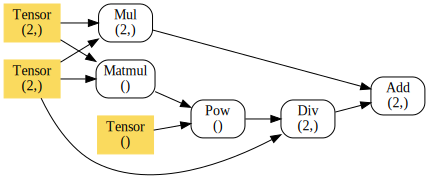

# Deep Learning Library only using NumPy

본 레포지토리는 NumPy 만으로 구현한 딥러닝 라이브러리입니다. 자동 미분이 구현되어 있습니다.

<p align="center">
  
</p>


## 자동 미분

`자동 미분`은 미분을 자동으로 계산해주는 기능입니다. 아래 코드는 자동 미분을 활용해 역전파를 수행합니다 :

```python
>>> from dl_numpy import Tensor, math
>>> a, b = Tensor([2, 1]), Tensor([-0.1, 0.3])
>>> out = math.sum(a * b)  # calculation
>>> grad = out.backward()  # backward
>>> grad[id(a)]  # gradient for a
[0.1 0.3]
```


## 계산 그래프

계산 그래프를 시각화할 수 있습니다. Tensor 연산 후 `graph.render()`를 호출하세요 :

```python
>>> out = a * b + math.matmul(a, b) ** 2 / a
>>> out.graph.render('calc_graph', format='svg')  # save graph as a svg file
```

<p align="center">
  
</p>


## 레이어

활성화 함수, loss 함수, layer가 모듈 형태로 정의되어 있습니다.

자동 미분이 구현되어 있으므로 각 모듈의 도함수를 정의할 필요는 없습니다. [코드 참고](dl_numpy/layer/activation.py)

```python
>>> from dl_numpy.layer.activation import sigmoid
>>> from dl_numpy.layer.loss import mse
>>> from dl_numpy.layer import Linear
>>> m = Linear(8, 32, activation=sigmoid)  # linear layer (Wx+b)
>>> out = m(x)  # forward
>>> loss = mse(y, out)  # MSE loss
>>> grad = loss.backward()  # backward
>>> m.apply_grad(grad, lr=0.01)  # update parameters
```

## 예제

- [`mnist_example.py`](mnist_example.py) : MNIST dataset을 학습하는 예제입니다.

##


※ 본 프로젝트는 이론 공부를 목적으로 진행되었습니다.
